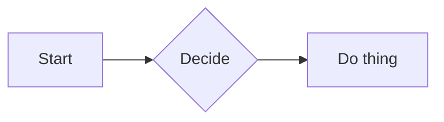

# Markdown Preview

A Manifest V3 Chrome extension that renders a live, sanitized HTML preview of
Markdown — either pasted / typed into a textarea or loaded from a file on
disk — in a side-by-side editor view.

Source: [`markdown-preview/`](../../markdown-preview/)

## What it does

- Opens a full-tab page with **Source** (textarea) on the left and **Preview**
  (rendered HTML) on the right.
- Re-renders on every keystroke (debounced ~80ms).
- Can load a `.md` / `.markdown` / `.txt` file via the File System Access API
  and re-read it on demand via **Reload**.
- Persists the last-used file handle in IndexedDB and the current textarea
  contents in `chrome.storage.local` so the preview tab survives restarts.
- Sync-scrolls the two panes by proportional position (toggleable).
- Renders fenced `mermaid` and `nomnoml` code blocks as inline SVG
  diagrams — fully local, no network. Libraries are vendored separately
  (see [Diagrams](#diagrams) below).

## Install (unpacked)

1. Open `chrome://extensions`.
2. Enable **Developer mode** (top-right toggle).
3. Click **Load unpacked** and select the
   [`markdown-preview/`](../../markdown-preview/) folder.
4. Pin the extension to the toolbar.
5. Click the toolbar icon → **Open preview tab**.

## Usage

- **Paste / type text**: just start typing in the left pane.
- **Open a file**: click **Open file…** in the preview toolbar, pick a
  markdown file, and the content loads into the editor.
- **Reload**: re-reads the current file from disk (useful when an external
  editor has saved changes — the File System Access API doesn't notify on
  change, so reloads are explicit).
- **Detach**: forgets the saved file handle. The editor contents stay.

## Architecture

Three execution contexts, all talking to each other only through
`chrome.storage.local` and IndexedDB:

- **`popup/`** — toolbar popup. A thin launcher: one button that opens the
  preview tab via `chrome.tabs.create`.
- **`preview/`** — the split-pane editor and preview. Owns the textarea, the
  file picker, the render loop, and scroll sync.
- **`lib/`** —
  - `render.js`: hand-rolled Markdown → sanitized HTML pipeline
    (tokenize → render blocks → render inline → DOM-walk sanitize).
  - `file-handle-store.js`: IndexedDB helpers for persisting the
    `FileSystemFileHandle` across sessions, plus `ensurePermission` and
    `readFile` wrappers. Same shape as `worklog/lib/file-handle-store.js` but
    scoped to this extension and read-only.

There is no background service worker — the preview tab is the only surface
that needs to hold state, and `chrome.storage.local` is enough to bridge it.

## Rendering & sanitization

`lib/render.js` is a small Markdown renderer covering:

- ATX headings (`#`–`######`)
- Emphasis (`**bold**`, `*italic*`, `~~strike~~`), inline code
- Fenced code blocks (``` ```lang …``` ```, plus `~~~`)
- Blockquotes (nested via recursion)
- Ordered / unordered lists with simple indent-based nesting
- Horizontal rules
- GFM-style tables with column alignment
- Links and images (with a `SAFE_URL` / `SAFE_IMG` allowlist that rejects
  `javascript:` and non-image `data:` URLs)
- Autolinks (`<https://…>`), hard line breaks (two trailing spaces)

After rendering, the HTML is parsed with `DOMParser` and walked with a
**tag + attribute allowlist**:

- Tags outside the allowlist are unwrapped to their text content.
- Event-handler attributes (`on*`) are dropped.
- `href` / `src` values that fail the URL allowlist are dropped.

Raw HTML in the source is not rendered — it's escaped by the inline pass
before the sanitizer ever sees it, so `<script>` in a markdown file appears
as literal text.

### Why not vendor `marked` + `DOMPurify`?

MV3 forbids remote JS and the repo has no build step. Vendoring both libs
adds ~60KB of minified blobs and an audit burden. The hand-rolled renderer is
~250 lines and covers the features a preview pane actually needs. If you need
footnotes, math, or task lists, this is the file to extend.

## Storage model

- **`chrome.storage.local.markdownDraft`** — the current textarea contents,
  saved on every edit so reopening the preview tab restores state.
- **IndexedDB `markdown-preview` / `handles` / `lastFile`** — the most
  recently opened `FileSystemFileHandle`. Opaque to `chrome.storage`; survives
  restarts but requires a user gesture (clicking **Reload**) to re-grant read
  permission.

## Diagrams

Fenced code blocks tagged **`mermaid`** or **`nomnoml`** are rendered as
inline SVG directly inside the preview:

<pre>


```nomnoml
[User] -> [Server] -> [DB]
```
</pre>

### Install the libraries (one-time)

The rendering libraries are not checked into git — they're large and
vendoring them would bloat the repo. Drop them into
[`markdown-preview/lib/vendor/`](../../markdown-preview/lib/vendor/) once:

```sh
# Mermaid (flowchart, sequence, class, ER, state, gantt, pie, gitGraph…)
curl -L \
  -o markdown-preview/lib/vendor/mermaid.esm.min.mjs \
  https://cdn.jsdelivr.net/npm/mermaid@11/dist/mermaid.esm.min.mjs

# Nomnoml (class / component diagrams)
curl -L \
  -o markdown-preview/lib/vendor/nomnoml.js \
  https://cdn.jsdelivr.net/npm/nomnoml@1.6.2/dist/nomnoml.js
```

See [`markdown-preview/lib/vendor/README.md`](../../markdown-preview/lib/vendor/README.md)
for rationale, version guidance, and audit notes.

### How the pass works

After every Markdown re-render, `lib/diagram-render.js` walks the rendered
DOM, finds `code.language-mermaid` / `code.language-nomnoml`, and replaces
each `<pre>` with the SVG returned by the library. Rendered SVGs are cached
by `(format, source)` so unchanged diagrams don't re-render while you type
elsewhere in the document. Libraries are loaded lazily on first use and
reused thereafter.

If a library file is missing, only that diagram shows an inline error
pointing at the vendor README; the rest of the preview keeps working.

### Security notes

- Mermaid is initialized with `securityLevel: "strict"` so script tags and
  event handlers in rendered SVG are removed.
- The diagram pass runs **after** the Markdown sanitizer, so user markdown
  can't inject arbitrary HTML via a fake diagram block — the source arrives
  as plain text inside a `<code>` element.
- The vendored libraries execute in the extension's origin and have access
  to `chrome.storage.local`. Only drop in files you've audited.

## Caveats

- **No live file watching.** The File System Access API provides no change
  events. Use **Reload** after saving the file in another editor.
- **No build step / no TypeScript.** Native ES modules with relative paths,
  same as the rest of the repo.
- **No network permission.** The extension never makes HTTP requests; all
  rendering is local.
- **Chromium-only for file open.** `showOpenFilePicker` isn't in Firefox
  stable yet; the textarea mode still works everywhere.
