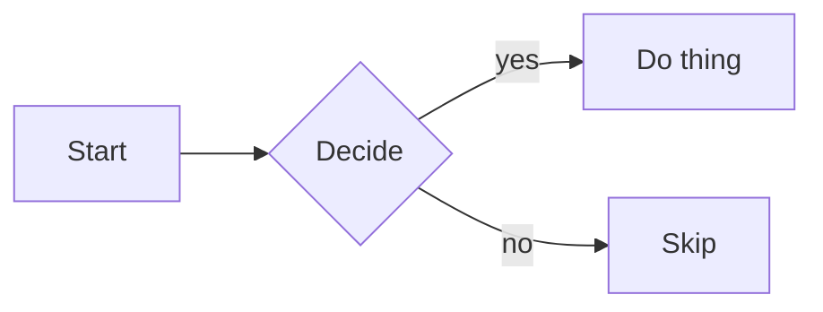

# Vendored diagram libraries

The Markdown preview renders fenced `mermaid` / `nomnoml` code blocks as SVG
diagrams. The rendering libraries are **not** checked into git — they're
large and vendoring them would bloat the repo — so you install them once by
downloading the files into this folder.

The extension only looks in this directory; no other setup is needed.

## Mermaid (flowchart, sequence, class, ER, state, gantt, pie, gitGraph…)

Expected file: **`mermaid.esm.min.mjs`**

```sh
curl -L \
  -o markdown-preview/lib/vendor/mermaid.esm.min.mjs \
  https://cdn.jsdelivr.net/npm/mermaid@11/dist/mermaid.esm.min.mjs
```

(Any mermaid 10.x / 11.x ESM build works. Pin a version you trust and audit
the file before loading it — this is a third-party binary blob executing in
your browser.)

Once present, fenced blocks render:

<pre>

</pre>

## Nomnoml (class / component / sequence diagrams, simpler syntax)

Expected file: **`nomnoml.js`**

```sh
curl -L \
  -o markdown-preview/lib/vendor/nomnoml.js \
  https://cdn.jsdelivr.net/npm/nomnoml@1.6.2/dist/nomnoml.js
```

Once present:

<pre>
```nomnoml
[Pirate|eyeCount: Int|raid();pillage()|
  [beard]--[parrot]
  [beard]-:>[foul mouth]
]
</pre>

## Both loaders are lazy

Mermaid / nomnoml are only fetched the first time a diagram of that kind
appears in your document. If a file is missing, diagrams of that type render
an inline error pointing back to this README; the rest of the preview keeps
working.

## Why not just bundle them?

1. **Repo size.** Mermaid's minified ESM is ~1MB; nomnoml is ~120KB.
2. **Audit surface.** Dropping them in yourself makes the dependency choice
   explicit and lets you pin / update / swap versions without touching code.
3. **No network at runtime.** Once downloaded, everything runs fully local —
   the extension never calls out.
